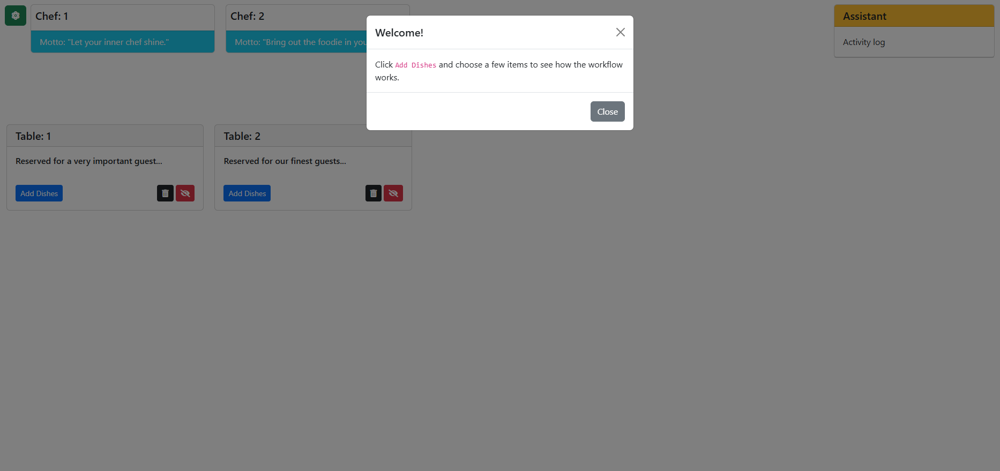
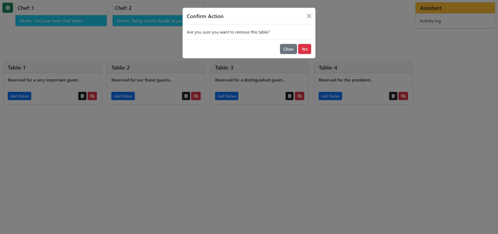

> 🌐 Language / Ngôn ngữ: **English** | [Tiếng Việt](How_it_work.vi.md)

Observer Pattern - Restaurant
=================

An example of applying the Observer Pattern to a simple restaurant project built with plain JavaScript.

This plain JavaScript version goes straight to the main screen after load and keeps the welcome modal open on first render. Under that modal you can already see the tables, chefs, the assistant panel, and the Controls area in the top-left corner.

There are 2 chefs in this demo so you can follow the cooking assignment flow.

This walkthrough combines the detailed step-by-step explanation with the screenshot narrative that is only summarized in the README.

Main UI States
------------

The first fully rendered screen, still showing the welcome modal:

Adding a table from the Controls panel:

The popup used to choose dishes for a table, with several dishes already selected in this example:

The confirmation dialog shown before removing a table:

Subscription, unsubscription, and removal action tooltips:

Main Flow
------------

1. Click the `Add Dishes` button on any table to open the popup and see the dishes available for selection.
2. Click the dish name buttons to select dishes. You can select multiple dishes.
3. Click `Order` to create one order item for each selected dish. The selected table sends those dishes into the restaurant workflow, and the **Assistant** queue is updated for that table.
4. The Assistant adds the incoming orders to its queue, waits 3 seconds, and then assigns pending dishes to chefs that are currently available.
5. While a chef is busy, the chef card shows the current dish and a progress bar. When the dish is ready, the chef notifies the Assistant.
6. The Assistant records both pickup and completion events in its activity log and notifies subscribed tables about the dish that has just finished cooking.
7. If a table ordered that completed dish, it starts its eating progress and then removes the dish from its list when the progress finishes.

Notes While Watching
------------

1. This version goes directly to the main screen after load and keeps the welcome modal open on the first render.
2. The Assistant assigns dishes to the chefs 3 seconds after receiving them from the tables.
3. Chefs notify the Assistant: each chef has an **Observer**, and the **Assistant** subscribes to updates from the chefs.
    1. A chef shows a pink border when a dish is finished.
    2. The Assistant shows a blue border and writes a log below when it receives a notification.
    3. The Assistant immediately notifies all tables.
4. The Assistant notifies the tables: the Assistant has an **Observer**, and the tables subscribe to updates from the Assistant.
    1. Tables show a yellow border and the `Receive updates from the assistant` tooltip when they receive a notification.
    2. A table that ordered the notified dish will display an eating progress bar.
5. The tooltip image above shows both idle subscription states, `Subscribe to assistant updates` and `Unsubscribe from assistant updates`, plus the remove-table action.

Observer Workflow Sequence
------------

Two chefs can be preparing dishes at the same time while another table is already eating a dish that finished earlier:

When the Assistant broadcasts a completed dish, subscribed tables highlight together, and the tables that ordered it immediately start eating:

One chef can still be cooking while the other is already idle after finishing a dish, and the subscribed table still shows the tooltip for receiving Assistant updates:

The Assistant activity log keeps recording new pickup and completion events while delivered dishes continue building up on the tables:

Subscribed tables continue reacting in parallel while chefs keep working through the queue:

A later state still shows subscribed tables reacting while the Assistant continues recording both pickup and completion events:

The final state shows active chef work, eating progress on multiple tables, subscription highlights, and the Assistant log all at once:

-------------------

\ ゜o゜)ノ
