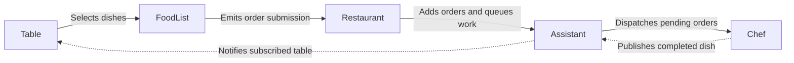
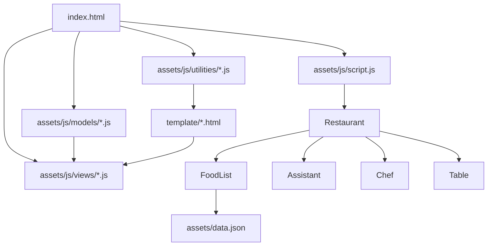

# Observer-Pattern-Restaurant

> 🌐 Language / Ngôn ngữ: **English** | [Tiếng Việt](README.vi.md)

## About
This project is a browser-based jQuery demo that simulates a restaurant workflow using the Observer Pattern. Tables select dishes, the restaurant forwards submitted orders to the assistant, chefs process the queue, and subscribed tables react when dishes are completed.

For a step-by-step walkthrough, see the English guide [How_it_work.md](./How_it_work.md) or the Vietnamese version [How_it_work.vi.md](./How_it_work.vi.md).

For a cross-project mapping between the plain JavaScript and Vue 2 implementations, see [PARITY_GUIDE.md](./PARITY_GUIDE.md) or the Vietnamese version [PARITY_GUIDE.vi.md](./PARITY_GUIDE.vi.md).

## Technologies Used
- HTML5 for the page shell and static asset loading.
- CSS3 and Bootstrap 5 for layout, modals, tooltips, cards, and progress styling.
- JavaScript (ES6+ classes) for the Observer Pattern models, state objects, and UI wiring.
- jQuery for DOM manipulation, event handling, and runtime interactions.
- Handlebars.js for runtime HTML template compilation and rendering.
- Draggabilly for draggable table cards.
- Node.js built-in test runner and jsdom for automated regression testing.

## What This Demo Shows
- A plain-browser jQuery application without a bundler or framework build step.
- An Observer Pattern workflow applied to a restaurant scenario.
- Handlebars-based template rendering for tables, chefs, assistant logs, and progress bars.
- A modular split between utilities, models, state objects, and DOM views.
- Automated regression tests for the core scheduling, event flow, and UI state logic.

## Main Flow
1. A table opens the menu and selects one or more menu items.
2. FoodList emits structured order submission events for the selected table.
3. Restaurant forwards the submitted orders to the assistant and updates the table state.
4. The assistant queues pending orders and dispatches them to available chefs.
5. Chefs publish completion updates, and subscribed tables react when their dishes are ready.

## Observer Flow Diagram


This is the main Observer Pattern loop in the demo: tables submit dishes through the food list, the restaurant wires the submission into the assistant queue, chefs publish completion updates, and subscribed tables react when their dishes are ready.

## Architecture Diagram


The application loads utilities, views, and model scripts directly from `index.html`; the bootstrap script creates the restaurant workflow, template utilities pull reusable HTML partials, and the food list loads menu data from JSON.

## Walkthrough

For the full screen-by-screen walkthrough, tooltip examples, and workflow sequence, see [How_it_work.md](./How_it_work.md) or the Vietnamese version [How_it_work.vi.md](./How_it_work.vi.md).

## Architecture Notes
- Shared observer behavior now lives in `assets/js/utilities/observable.js` and is reused by Assistant, Chef, and FoodList.
- Shared statuses, messages, timeouts, and log levels now live in `assets/js/utilities/constants.js`.
- Shared event creation now lives in `assets/js/utilities/event-factory.js`, so models emit standardized event objects instead of hand-building payloads.
- `assets/js/models/table-state.js`, `assets/js/models/chef-state.js`, `assets/js/models/food-list-state.js`, and `assets/js/models/progress-state.js` keep domain state separate from DOM concerns.
- DOM-specific rendering and binding now live in `assets/js/views/food-list-view.js`, `assets/js/views/table-view.js`, `assets/js/views/chef-view.js`, and `assets/js/views/progress-view.js`.

## Improvements Already Applied
- Logging is standardized through `assets/js/utilities/logger.js`, which supports log levels and can be silenced in tests.
- Order dispatch rules were extracted to `assets/js/models/order-scheduler.js`, keeping FIFO assignment logic testable without DOM setup.
- Progress completion logic and timer cleanup were separated from progress bar rendering.
- The regression suite now covers event flow, confirmed table removal, scheduler behavior, progress cleanup, and startup failures.

## Project Structure
```text
.
├── assets/
│   ├── css/
│   ├── data.json
│   └── js/
│       ├── models/
│       ├── utilities/
│       ├── views/
│       └── script.js
├── template/
│   ├── handlebar.html
│   ├── modal-foods.html
│   └── parts.html
├── screenshots/
├── test/
│   └── support/
├── index.html
├── package.json
├── How_it_work.md
└── How_it_work.vi.md
```

## Run Locally
Because this project loads templates and menu data over HTTP, it should be served instead of opened with `file://`.

### Use any static server
Examples:
- `npx serve .`
- `python3 -m http.server 8080`

Then open the app in your browser.

## Testing
Install dependencies:

```bash
npm install
```

Run the regression suite:

```bash
npm test
```

The tests cover three core flows:
- assistant order queue dispatch
- table subscription lifecycle
- chef assignment when multiple orders are pending

The suite also covers:
- confirmed table removal in the Restaurant model
- pure order scheduling logic without the DOM harness
- progress completion and timer cleanup
- startup failures for template loading and menu loading

## Notes
- This project is intentionally browser-first and lightweight.
- The demo favors clarity of Observer Pattern interactions over production build tooling.
- The walkthrough documents are the fastest way to follow the workflow step by step.
