# Observer-Pattern-Restaurant

> 🌐 Language / Ngôn ngữ: [English](README.md) | **Tiếng Việt**

## Giới thiệu
Đây là dự án demo chạy trên trình duyệt với jQuery để mô phỏng quy trình vận hành nhà hàng bằng Observer Pattern. Bàn chọn món, restaurant chuyển đơn đã gửi sang assistant, đầu bếp xử lý hàng đợi, và các bàn đã đăng ký sẽ phản ứng khi món ăn hoàn tất.

Để xem hướng dẫn từng bước, hãy mở bản tiếng Anh tại [How_it_work.md](./How_it_work.md) hoặc bản tiếng Việt tại [How_it_work.vi.md](./How_it_work.vi.md).

Để đối chiếu nhanh giữa bản plain JavaScript và bản Vue 2, hãy xem [PARITY_GUIDE.vi.md](./PARITY_GUIDE.vi.md) hoặc bản tiếng Anh [PARITY_GUIDE.md](./PARITY_GUIDE.md).

## Công nghệ sử dụng
- HTML5 để dựng khung trang và nạp các static asset.
- CSS3 và Bootstrap 5 cho layout, modal, tooltip, card, và thanh tiến trình.
- JavaScript (ES6+ classes) cho các model Observer Pattern, state object, và logic liên kết UI.
- jQuery cho thao tác DOM, xử lý sự kiện, và các tương tác runtime.
- Handlebars.js để biên dịch và render template HTML ở runtime.
- Draggabilly để kéo thả các thẻ bàn.
- Node.js built-in test runner và jsdom cho bộ kiểm thử hồi quy tự động.

## Dự án minh họa điều gì
- Một ứng dụng jQuery chạy trực tiếp trên trình duyệt, không cần bundler hay framework build step.
- Một luồng Observer Pattern áp dụng vào bài toán nhà hàng.
- Cách render giao diện bằng Handlebars cho bàn, đầu bếp, nhật ký assistant, và progress bar.
- Cách tách module thành utilities, models, state objects, và DOM views.
- Bộ kiểm thử hồi quy tự động cho các luồng lập lịch, event flow, và trạng thái UI cốt lõi.

## Luồng chính
1. Một bàn mở menu và chọn một hoặc nhiều món ăn.
2. FoodList phát ra structured event gửi đơn cho bàn đang chọn.
3. Restaurant chuyển các đơn vừa gửi sang assistant và cập nhật trạng thái của bàn.
4. Assistant đưa đơn vào hàng đợi và phân phối cho các đầu bếp đang rảnh.
5. Chef phát thông báo khi món hoàn tất, và các bàn đã đăng ký sẽ phản ứng khi món của mình sẵn sàng.

## Sơ đồ Observer Flow
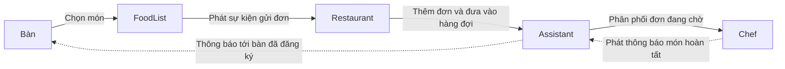

Đây là vòng lặp Observer Pattern chính của bản demo: bàn gửi món qua food list, restaurant nối luồng gửi đơn vào hàng đợi của assistant, chef phát cập nhật khi hoàn tất món, và các bàn đã đăng ký sẽ phản ứng khi món của mình sẵn sàng.

## Sơ đồ kiến trúc
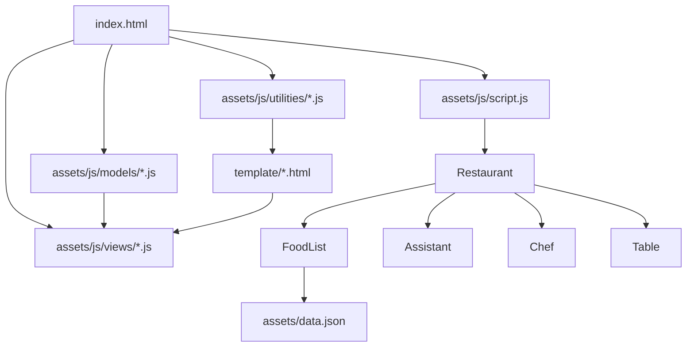

Ứng dụng nạp trực tiếp utilities, views, và model scripts từ `index.html`; file bootstrap tạo luồng restaurant, utility template lấy các HTML partial dùng lại được, và food list nạp dữ liệu món ăn từ JSON.

## Ảnh chụp màn hình

### Các trạng thái chính của giao diện

Màn hình ban đầu sau khi ứng dụng tải xong:


Thêm bàn mới từ bảng điều khiển:

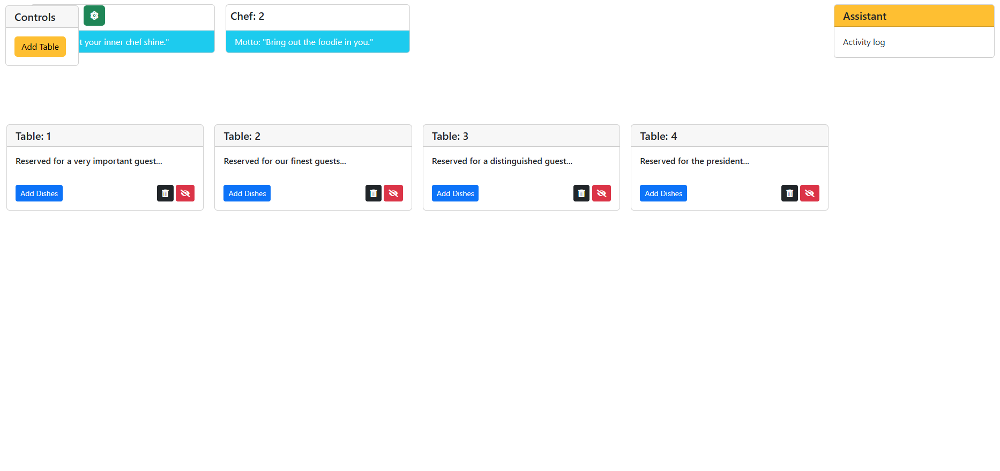

Chọn món trong hộp thoại popup của bàn:

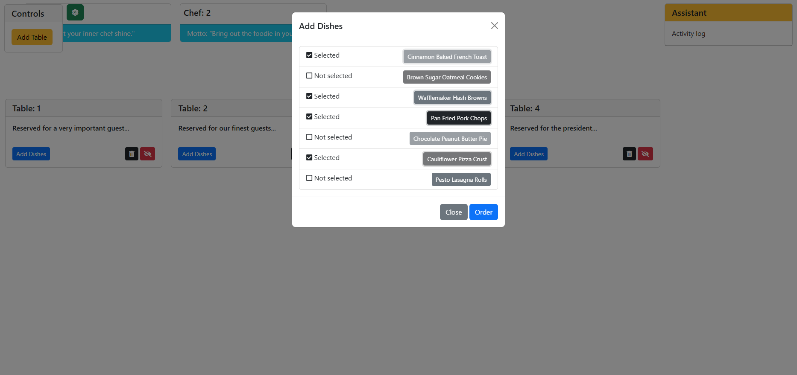

Xác nhận xóa bàn:

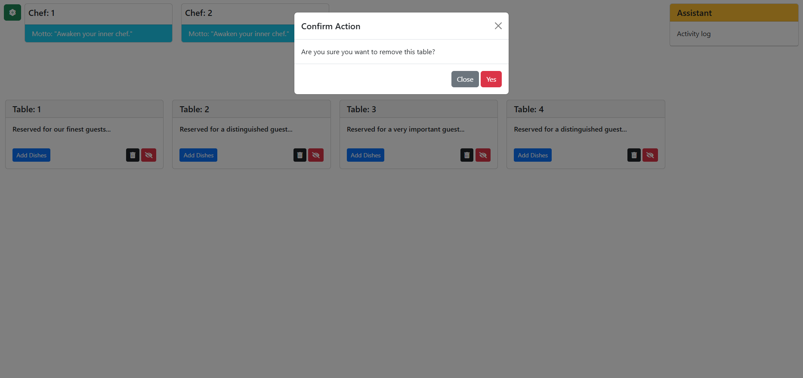

Tooltip cho thao tác đăng ký nhận thông báo và xóa bàn:

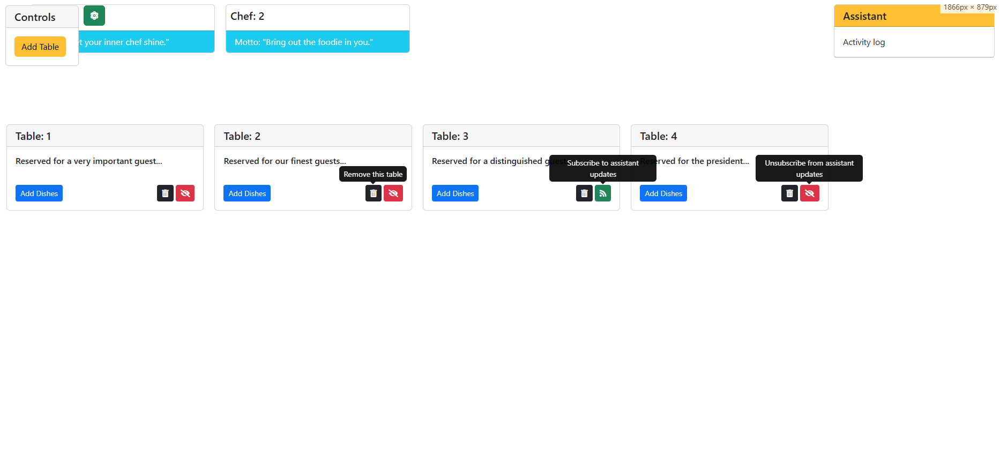

### Chuỗi quy trình Observer

Đơn hàng được nhận và phân phối tới các đầu bếp:

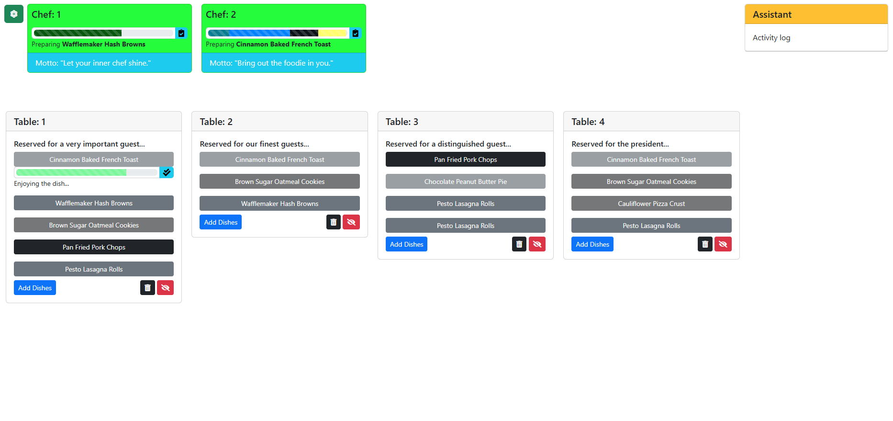

Assistant chuyển tiếp thông báo món hoàn tất về các bàn đã đăng ký:

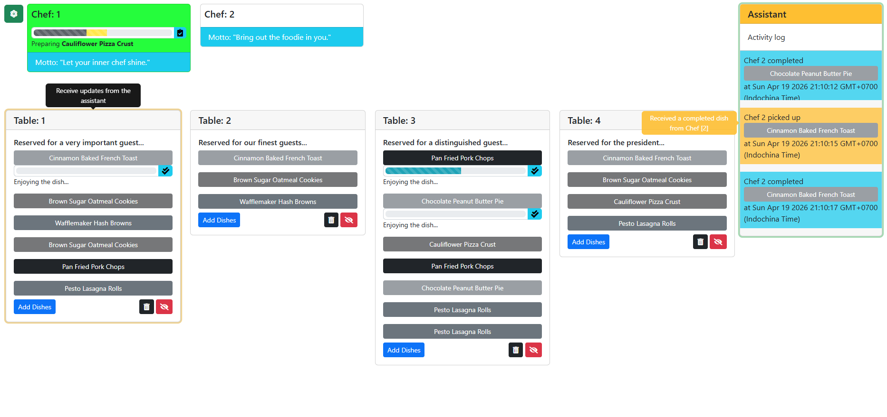

Nhiều cập nhật từ bếp có thể đến các bàn cùng lúc:

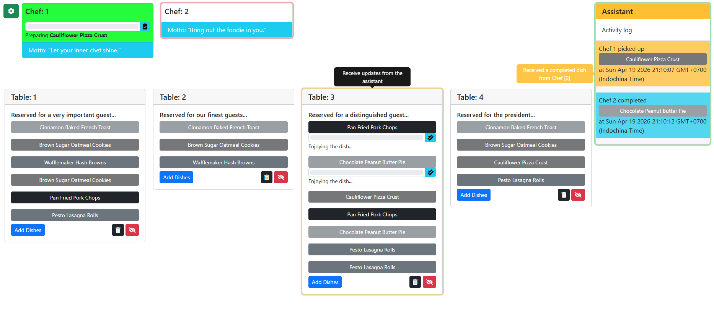

Nhật ký hoạt động ghi lại các lần nhận món và hoàn tất món:

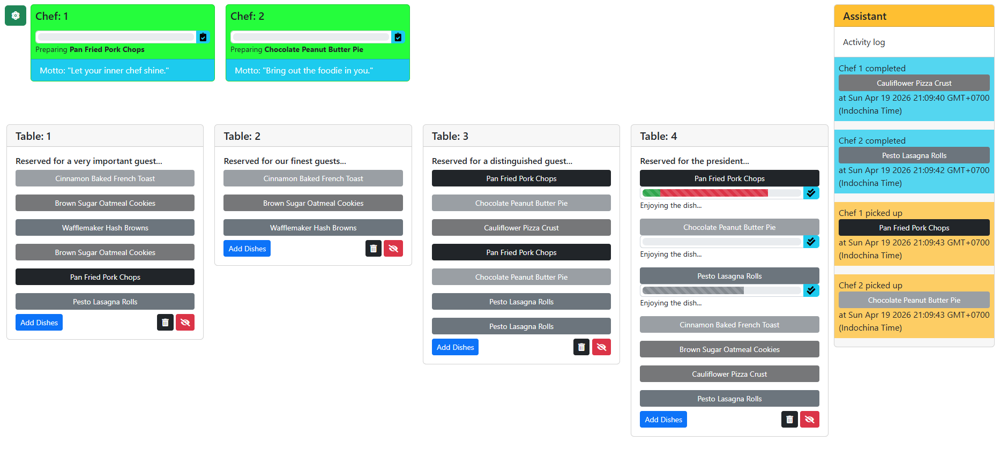

Các bàn tiếp tục nhận cập nhật trong khi đầu bếp xử lý hàng đợi:

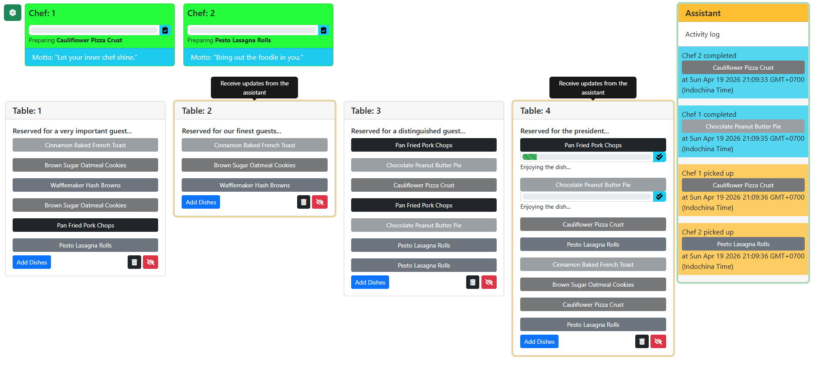

Một món hoàn tất khác tiếp tục được broadcast tới các bàn đã đăng ký:

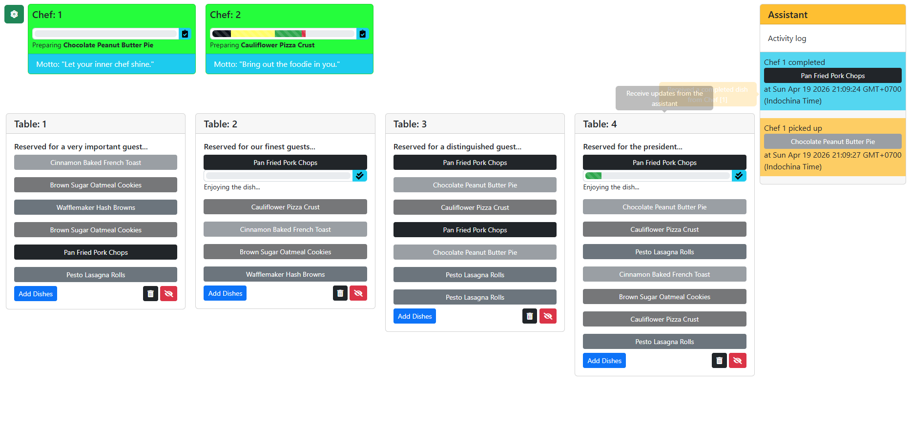

Quy trình kết thúc với trạng thái bàn và nhật ký assistant đã được cập nhật:

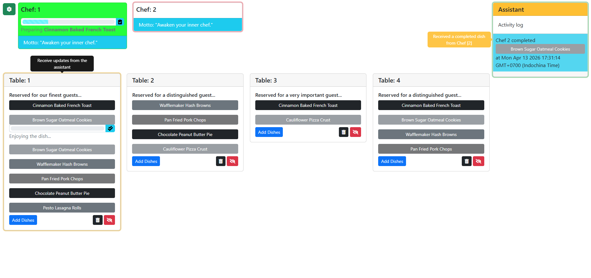

## Ghi chú kiến trúc
- Hành vi observer dùng chung hiện nằm trong `assets/js/utilities/observable.js` và được Assistant, Chef, và FoodList tái sử dụng.
- Các status, message, timeout, và log level dùng chung hiện nằm trong `assets/js/utilities/constants.js`.
- Việc tạo event dùng chung hiện nằm trong `assets/js/utilities/event-factory.js`, giúp các model phát ra event object theo chuẩn thay vì tự ghép payload thủ công.
- `assets/js/models/table-state.js`, `assets/js/models/chef-state.js`, `assets/js/models/food-list-state.js`, và `assets/js/models/progress-state.js` giữ domain state tách biệt khỏi phần DOM.
- Phần render và binding hiện nằm trong `assets/js/views/food-list-view.js`, `assets/js/views/table-view.js`, `assets/js/views/chef-view.js`, và `assets/js/views/progress-view.js`.

## Các cải tiến đã áp dụng
- Logging được chuẩn hóa qua `assets/js/utilities/logger.js`, có hỗ trợ log level và có thể tắt trong môi trường test.
- Quy tắc phân phối đơn hàng được tách sang `assets/js/models/order-scheduler.js`, giúp logic FIFO có thể kiểm thử mà không cần dựng DOM.
- Logic hoàn tất tiến trình và dọn dẹp timer được tách khỏi phần render của progress bar.
- Bộ kiểm thử hồi quy hiện bao phủ event flow, xác nhận xóa bàn, hành vi scheduler, dọn dẹp progress, và lỗi khởi động.

## Cấu trúc dự án
```text
.
├── assets/
│   ├── css/
│   ├── data.json
│   └── js/
│       ├── models/
│       ├── utilities/
│       ├── views/
│       └── script.js
├── template/
│   ├── handlebar.html
│   ├── modal-foods.html
│   └── parts.html
├── screenshots/
├── test/
│   └── support/
├── index.html
├── package.json
├── How_it_work.md
└── How_it_work.vi.md
```

## Chạy ở máy cục bộ
Vì dự án này nạp template và dữ liệu món ăn qua HTTP, bạn nên serve nó thay vì mở trực tiếp bằng `file://`.

### Dùng bất kỳ static server nào
Ví dụ:
- `npx serve .`
- `python3 -m http.server 8080`

Sau đó mở ứng dụng trên trình duyệt.

## Kiểm thử
Cài dependencies:

```bash
npm install
```

Chạy bộ kiểm thử hồi quy:

```bash
npm test
```

Bộ kiểm thử bao phủ ba luồng chính:
- phân phối hàng đợi đơn hàng của assistant
- vòng đời đăng ký nhận thông báo của bàn
- phân công đầu bếp khi có nhiều đơn hàng đang chờ

Bộ kiểm thử hiện cũng bao phủ thêm:
- xác nhận xóa bàn trong model Restaurant
- logic lập lịch đơn hàng thuần túy, không cần DOM harness
- hoàn tất tiến trình và dọn dẹp timer
- lỗi khởi động khi tải template hoặc tải menu thất bại

## Ghi chú
- Dự án này cố ý giữ cách tiếp cận browser-first và gọn nhẹ.
- Bản demo ưu tiên làm rõ tương tác Observer Pattern hơn là mô phỏng một quy trình build cho production.
- Bộ tài liệu `How_it_work` là cách nhanh nhất để theo dõi luồng hoạt động từng bước.